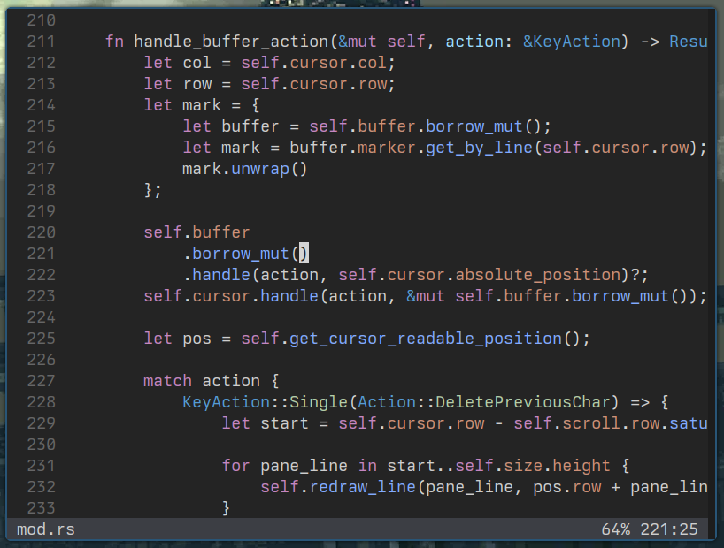

<div align="center">

<h1>Glyph</h1>

lightweight terminal based text editor written in rust.



</div>

---

## What is Glyph

Glyph is a terminal based text editor highly inspired by neovim. It aims to be
lightweight without sacrificing usability.

## Roadmap
I've written some sort of roadmap, that is actually just a reference to all the
features that I want to accomplish with the editor. That list, aswell as every
other thing in this project is subject to change at any point, new features may
be included or be removed as time goes by.

[Check the roadmap here](./ROADMAP.md)

## Current Status

Glyph is under intense development, expect bugs as there are no stable version
of glyph as of right now. But be encouraged to test the editor and maybe give me
some feedback.

New commits are pushed basically daily, and my intention is to make it stable by
the first alpha release, but be aware that things may break at any point.

## Motivation

Glyph started as a project in which my goal were to learn about text editors 
architecture, design, algorithms and all other intricacies that come along the 
way and soon started to become a project in which I wanted to make an actual
useful software.

## Getting Started

This is a simple guide to get started using the editor and will be heavily 
expanded as time goes on. But this will be enough to give you direction onto how
to setup the project and test by yourself.

1. Clone the repository
```sh
git clone https://github.com/wllfaria/glyph.git
cd glyph
```

2. Install the binary
```sh
cargo install --path ./crates/glyph
```

3. Configure for your first use.
```
mkdir ~/.config/glyph
cp ./config/glyph.toml ~/.config/glyph/glyph.toml
cp -R ./config/themes ~/.config/glyph
```

4. Start editing!
```sh
gly <path_to_file>
```